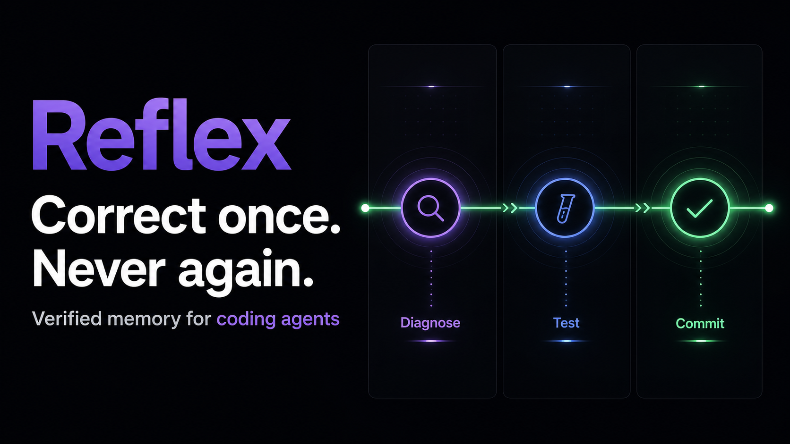

# Reflex

> Correct once. Never again.

Reflex is the verified memory layer for coding agents. A developer corrects an agent once; Reflex diagnoses the general rule, writes a regression eval, proves that the eval fails on the original code and passes on the correction with zero regressions, then commits the lesson to `AGENTS.md` and a reusable Codex Skill.

Built for the **OpenAI Build Week 2026 — Developer Tools** track with Codex and GPT-5.6 Sol.



## Judge-friendly demo

The hosted app opens in deterministic showcase mode, so the complete story works without sharing a key or rebuilding the project:

1. Click **Run “Add /health”**.
2. The clean-session agent proposes `unittest` plus `print()`.
3. Click **Correct once** to apply the repository's pytest + structlog convention.
4. Click **Accept with correction**.
5. Watch the streamed Reflex loop: diagnose → generalize → write eval → fail before → pass after → zero regressions → commit.
6. Click **Start fresh session**. The new `/version` patch applies pytest + structlog on its first attempt, using only the repository memory Reflex wrote.
7. Open **Memory** to inspect the committed `AGENTS.md`, Codex Skill, regression eval, and learning ledger.

Use **Reset demo** in the header to restore the exact seed state between runs.

## What is real

- Durable D1 records for repository state, corrections, rules, skills, evals, and metrics.
- Server-Sent Events for the verification timeline.
- A four-tool virtual repository harness: `list_files`, `read_file`, `write_file`, and `run_tests`.
- GPT-5.6 Sol on the Responses API for fresh-session agent turns and correction diagnosis when `OPENAI_API_KEY` is configured.
- Strict Structured Outputs for the rule, rationale, Skill, regression eval, and machine-checkable assertions.
- Independent host verification: the eval must fail on `BEFORE`, pass on `AFTER`, and preserve the 24-test baseline before memory is committed.
- A deterministic no-key path for reliable judging. It exercises the same persistence, verification, SSE, and memory-writing code paths as live mode.

## Run locally

Requirements:

- Node.js 22.13+
- npm
- Optional: an OpenAI Platform key for live GPT-5.6 Sol calls

```bash
npm install
npm run seed
npm run dev
```

Open the local URL printed by the development server.

The app works immediately in showcase mode. To enable live mode, copy `.env.example` to `.env.local`, set `OPENAI_API_KEY`, and restart the development server. Never commit the populated env file.

```bash
OPENAI_API_KEY=your-local-secret
OPENAI_MODEL=gpt-5.6-sol
```

## Validate

```bash
npm test
npm run lint
```

The test command builds the Cloudflare-compatible application, server-renders the product shell, checks that the starter UI is removed, and verifies the required correction/agent contracts in source. The seeded Python repository can also be tested directly:

```bash
cd sandbox-repos/demo
python -m pytest -q
```

## Architecture

```text
Reflex workspace
  ├─ Coding-agent chat
  ├─ Editable patch review
  ├─ Animated SSE verification timeline
  └─ Repository memory viewer
           │
           ▼
Next/Vinext route handlers on Cloudflare Workers
  ├─ /api/agent   → Responses API tool loop or replay-safe first turn
  ├─ /api/correct → capture BEFORE / AFTER / context
  ├─ /api/reflex  → diagnose, eval, verify, commit (SSE)
  ├─ /api/state   → durable repository memory and metrics
  └─ /api/reset   → deterministic seed restore
           │
           ├─ GPT-5.6 Sol + Structured Outputs
           └─ Cloudflare D1
                ├─ repository_state
                ├─ corrections
                └─ rules
```

The hosted demo models a repository as a D1-backed virtual filesystem. This avoids executing arbitrary model-authored code on the public Worker. The local seed repository is included for repeatable pytest runs. A production deployment would move arbitrary-code execution into an ephemeral container with no network, a non-root user, CPU/memory/time limits, and a human approval gate before writing to the real repository.

## Key decisions

### The eval is the product, not decoration

Reflex never commits a rule just because a model suggested one. The host independently runs strict assertions against both versions of the patch and the repository baseline. Verification evidence is part of the persisted record and the visible timeline.

### Repository memory stays portable

The output is plain, durable developer infrastructure:

- `AGENTS.md` for every compatible coding agent.
- `.codex/skills/repository-conventions/SKILL.md` for a reusable Codex workflow.
- `tests/test_repository_conventions.py` for CI-enforced proof.

### The first turn is replay-safe

The opening mistake is deterministic so a network hiccup cannot ruin the 90-second demo. Once the correction is committed, the new session uses the live GPT-5.6 tool harness when a key is available. The UI always labels the active runtime mode.

## How Codex accelerated the build

Codex was used as the primary engineering environment for the complete project: recovering the image-only blueprint, verifying current GPT-5.6/Responses API documentation, scaffolding the Cloudflare-compatible app, implementing the D1 schema and API routes, designing the interactive product UI, exercising the full API loop, generating tests, and preparing deployment/submission materials.

The highest-leverage Codex decisions were:

- translating the blueprint's local SQLite/subprocess design into a safe hosted D1 + virtual-sandbox architecture;
- preserving a deterministic judging path without weakening the real live-model integration;
- making verification evidence a first-class streamed product surface;
- keeping secrets out of the client and out of source control;
- building the fresh-session proof as the demo's final, falsifiable outcome.

## GPT-5.6 integration

`lib/agent.ts` implements the Responses API function-tool loop with GPT-5.6 Sol, `previous_response_id`, persisted reasoning context, tool call execution, and `function_call_output` continuation.

`lib/reflex-engine.ts` uses GPT-5.6 Sol at high reasoning effort and strict `text.format` JSON Schema output to produce the generalized rule, rationale, Skill, regression eval, and assertions. The host validates the schema with Zod and then verifies it independently.

## Supported platform

- Modern desktop and mobile browsers
- Local Node.js development on macOS, Linux, and Windows
- Hosted Cloudflare Worker deployment through OpenAI Sites

## Security notes

- The API key is server-only and optional.
- `.env*` is ignored, with only the blank `.env.example` committed.
- Repository paths in the live tool harness reject absolute paths and traversal.
- Model-authored code is not executed in the public Worker.
- Live writes are proposals until a human accepts the correction.
- D1 statements use bound parameters.

## Project map

```text
app/ReflexApp.tsx          Product UI and demo state machine
app/api/agent/             Coding-agent turn
app/api/correct/           Correction capture
app/api/reflex/            Streamed Reflex loop
lib/agent.ts               GPT-5.6 tool harness
lib/reflex-engine.ts       Diagnosis schema and verification
lib/repository.ts          D1 persistence and memory writer
db/schema.ts               Durable schema
sandbox-repos/demo/        Deterministic FastAPI + pytest seed
scripts/seed-demo.mjs      One-command local seed reset
SUBMISSION.md              Paste-ready Devpost package and video script
```

## License

MIT — see [LICENSE](LICENSE).
